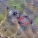
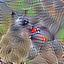
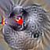
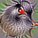
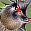

# Creating an Adversarial AI Patch

### Introduction

In this repo, we use a small version of the ImageNet library to train an adversarial patch to fool the AI into thinking all images are the same animal.

To increase robustness, random rotation and random scaling can be introduced by modifying the rotate and scale variables in the patch_attack() function. For each, the base model, rotation without scaling and rotation with scaling I have generated patches presented below along with their overall accuracy % as reported by the eval_patch() function.

#### Base (No Rotation or Scaling):

5 epochs: 99.92%    

10 epochs: 99.98% accuracy    

#### Rotation No Scaling:
*Note: Rotations were in the range of 0 to 360 degrees.

10 epochs, but random rotation was only applied once per epoch: 87.89% accuracy    

10 epochs: 94.94% accuracy    

15 epochs: 97.42% accuracy    

#### Rotation And Scaling:
*Note: Scaling was performed once per epoch unless specified. Patches were scaled randomly from 0.5 to 1 times the original size and were applied for both the x and y axes of the image uniformly to keep the patch square.

10 epochs every step: 66.32% accuracy    

10 epochs: 73.65% accuracy    

25 epochs: 90.85% accuracy    

50 epochs: 95.95% accuracy    

Rotation and scaling was attempted due to the discussion in the tutorial referencing Brown et al. As we can see, the base model provided in the tutorial (with a slight bump to the number of epochs) resulted in the highest accuracy of prediction from the model. However, we see that with some modifications to the number of epochs and how we introduce scaling, we can still achieve a high level of accuracy with random scaling and rotations. Some surprising results were that although implementing scaling at every step lowered the accuracy, for rotation, applying it once per epoch instead of every step actually caused worse performance.

### Citations
Lippe, Phillip, & Bent, Brinnae, PhD "Tutorial 10: Adversarial attacks." Github, 2024, https://github.com/AIPI-590-XAI/Duke-AI-XAI/blob/main/adversarial-ai-example-notebooks/adversarial_attacks.ipynb

